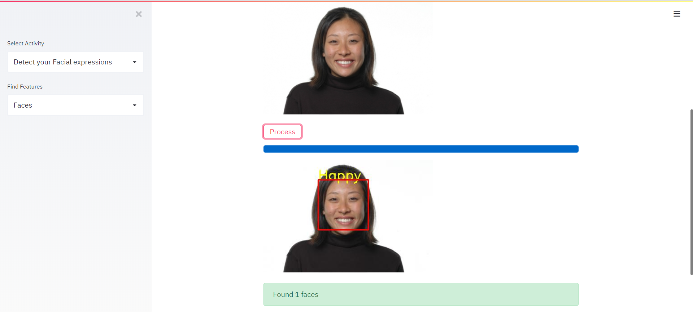

# Emotion-Recognition Web Application With Streamlit 
A CNN based Tensorflow implementation on facial expression recognition (FER2013 dataset), achieving 66,72% accuracy 

### Dependencies:
- python 3.7 
- Keras with TensorFlow as backend 
- Streamlit framework for web implementation

### FER2013 Dataset:
- Dataset from https://www.kaggle.com/c/challenges-in-representation-learning-facial-expression-recognition-challenge/data 
- Image Properties: 48 x 48 pixels (2304 bytes) 
- labels: 0=Angry, 1=Disgust, 2=Fear, 3=Happy, 4=Sad, 5=Surprise, 6=Neutral 
- The training set consists of 28,708 examples. 
- The model is represented as a json file :model.json

The separated dataset is already available to download in the two folders train and test.
### Run the project on your local:

- Open Anaconda's command prompt on the project's directory. 
- Install virtual environment : `pip install virtualenv`  
- Create virtual environment : `virutalenv venv`  
- Activate the virtual environment : `source venv/bin/activate`  
- Install dependencies requirements.txt : `pip install -r requirements.txt` 
- Install Streamlit : `pip install streamlit`  
- Run the app.py file : `streamlit run app.py"`

### Demos:

